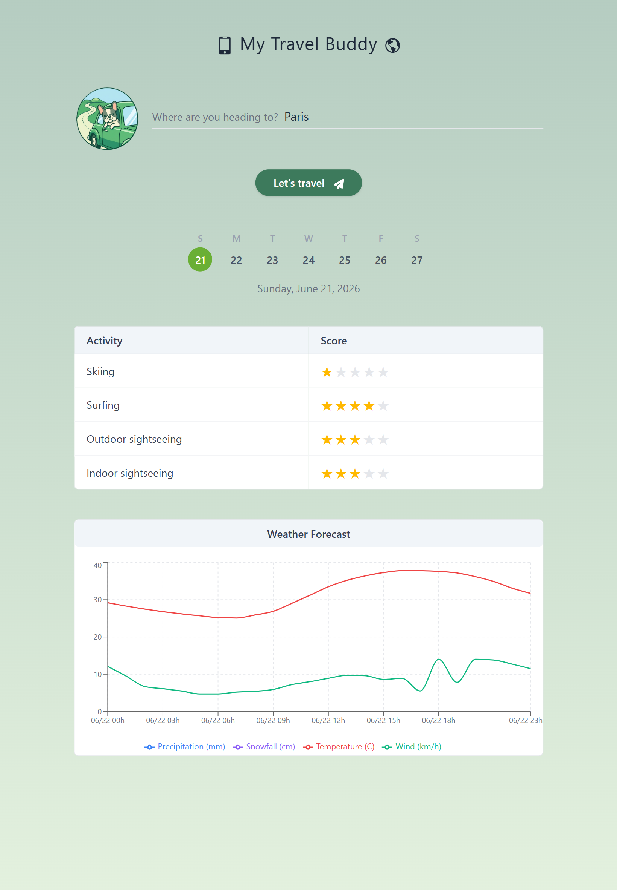
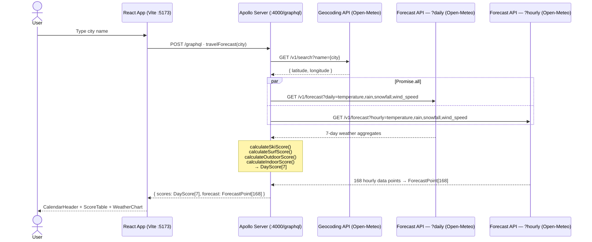
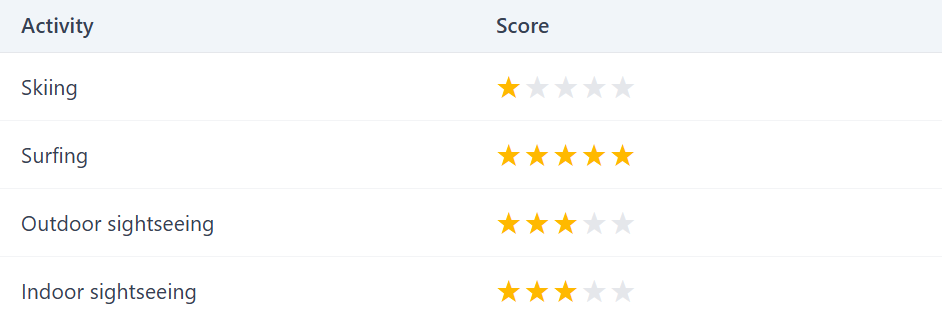
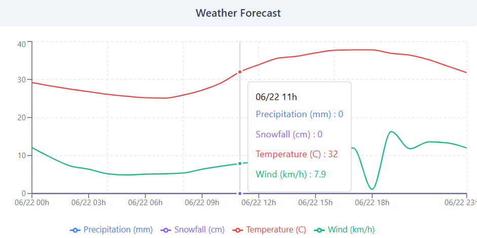

# My Travel Buddy 📱🌎

A full-stack web application that accepts a city name and returns a 7-day forecast of how desirable the destination will be for four leisure activities: **Skiing**, **Surfing**, **Outdoor sightseeing**, and **Indoor sightseeing**, as well as a multi-series line chart of weather variables which were used to rank those activities (temperature, precipitation, snowfall, wind speed). Activities are scored 1–5 based on live data from those weather variables sourced from the official [Open-Meteo](https://open-meteo.com/en/docs) API documentation.

## Application States 1️⃣→2️⃣→3️⃣

The UI has four key states during the city search and forecast flow:

1. **Initial**: the input is empty and no results are displayed yet.
2. **Error**: an invalid or unknown city shows a clear validation message.
3. **Loading**: skeleton placeholders are shown while data is being fetched.
4. **Loaded**: calendar header, activity scores, and weather chart render after a successful query.

| Initial                                              | Error                                            |
| ---------------------------------------------------- | ------------------------------------------------ |
|  |  |

| Loading                                              | Loaded                                             |
| ---------------------------------------------------- | -------------------------------------------------- |
|  |  |

---

## System Architecture 🏗️



---

## Tech Stack 🧰

| Layer    | Technology                                                                       |
| -------- | -------------------------------------------------------------------------------- |
| Frontend | React 19, TypeScript, Vite, Apollo Client 4 (GraphQL), Tailwind CSS v4, Recharts |
| Backend  | Node.js, Apollo Server 4 (GraphQL), TypeScript                                   |
| Data     | Open-Meteo (Geocoding API + Weather Forecast API)                                |
| AI       | GitHub Copilot, Claude                                                           |

---

## Project Structure 🌳

```
my-travel-buddy-app/
├── README.md
├── client/                         # React frontend (Vite)
│   ├── eslint.config.js
│   ├── index.html
│   ├── package.json
│   ├── tsconfig.json
│   ├── tsconfig.app.json
│   ├── tsconfig.node.json
│   ├── vite.config.ts
│   ├── public/
│   │   └── app-logo.png
│   └── src/
│       ├── App.tsx
│       ├── App.css
│       ├── main.tsx
│       ├── index.css
│       ├── types/
│       │   └── index.ts            # Shared TypeScript types
│       └── components/
│           ├── SearchBar.tsx       # City input + CTA button
│           ├── CalendarHeader.tsx  # 7-day date selector
│           ├── ScoreTable.tsx      # Activity scores (★ ratings)
│           ├── StarRating.tsx      # 1–5 star component
│           ├── WeatherChart.tsx    # Recharts LineChart (4 variables)
│           └── SkeletonLoader.tsx  # Loading skeleton
│
└── server/                         # Apollo Server (GraphQL API)
    ├── package.json
    ├── tsconfig.json
    └── src/
        ├── index.ts                # Server entrypoint
        ├── schema/
        │   └── typeDefs.ts         # GraphQL type definitions
        ├── resolvers/
        │   ├── index.ts
        │   └── travelForecast.ts   # Root query resolver
        ├── services/
        │   ├── geocoding.ts        # Open-Meteo Geocoding API
        │   ├── weatherDaily.ts     # Open-Meteo /forecast?daily
        │   └── weatherHourly.ts    # Open-Meteo /forecast?hourly
        ├── scorers/
        │   ├── index.ts
        │   ├── calculateSkiScore.ts
        │   ├── calculateSurfScore.ts
        │   ├── calculateOutdoorScore.ts
        │   └── calculateIndoorScore.ts
        └── types/
            └── index.ts
```

---

## Getting Started 👨‍💻

### Prerequisites

- Node.js ≥ 18
- npm ≥ 9

### Installation

```bash
# Install server dependencies
cd server && npm install

# Install client dependencies
cd ../client && npm install
```

### Running locally

```bash
# Terminal 1 — start the GraphQL API
cd server && npm run dev

# Terminal 2 — start the React app
cd client && npm run dev
```

> Open [http://localhost:5173](http://localhost:5173) in your browser.

(_The Apollo Server GUI GraphQL endpoint is available at [http://localhost:4000/](http://localhost:4000/)_).

## GraphQL API 🌐

### Query

```graphql
query TravelForecast($city: String!) {
  travelForecast(city: $city) {
    scores {
      ski
      surf
      outdoor
      indoor
    }
    forecast {
      time
      temperature
      precipitation
      wind
      snowfall
    }
  }
}
```

### Response

| Field      | Type              | Description                                                                | Example                                                                                          |
| ---------- | ----------------- | -------------------------------------------------------------------------- | ------------------------------------------------------------------------------------------------ |
| `scores`   | `[DayScore]`      | 7-position array with per-day, per-activity scores (1–5), index 0 = today  | `[ { ski: 1, surf: 4, outdoor: 3, indoor: 3 } ]`                                                 |
| `forecast` | `[ForecastPoint]` | 168-position array with hourly data points (1 point/h x 24 h/day x 7 days) | `[ { time: "2026-06-22T00:00", temperature: 22.6, precipitation: 0, wind: 12.1, snowfall: 0 } ]` |

## Scoring Rationale 📊

The open-meteo documentation lists several weather variables. Taking all of them into consideration would overcomplicate the backend logic and algorithm complexity. I then decided to select the four most relevant ones to serve as the foundation for the calculation of the desirability scores across all four activities.

I decided to model the desirability score (ranged between 1 and 5) for each activity as a **linear function** of four weather variables: temperature (°C), rain (mm), wind speed (km/h), and snowfall (cm).

- $$ski_{score} = (a_{ski} \times temperature) + (b_{ski} \times precipitation) + (c_{ski} \times wind) + (d_{ski} \times snow)$$

- $$surf_{score} = (a_{surf} \times temperature) + (b_{surf} \times precipitation) + (c_{surf} \times wind) + (d_{surf} \times snow)$$

- $$outdoor_{score} = (a_{outdoor} \times temperature) + (b_{outdoor} \times precipitation) + (c_{outdoor} \times wind) + (d_{outdoor} \times snow)$$

- $$indoor_{score} = (a_{indoor} \times temperature) + (b_{indoor} \times precipitation) + (c_{indoor} \times wind) + (d_{indoor} \times snow)$$

(_the GraphQL query was built using the **&daily=** parameter, which operates a 24 hour aggregation from hourly values_)

| Activity                | Temperature                       | Rain                         | Wind                       | Snowfall               |
| ----------------------- | --------------------------------- | ---------------------------- | -------------------------- | ---------------------- |
| **Skiing**              | Ideal [−5, 0 °C]; >5 °C → score 1 | Instant penaliser            | Penalty above 30 km/h      | Major boost            |
| **Surfing**             | Warm preference (scales up)       | Mild penalty                 | Positive (wave generation) | Instant score 1        |
| **Outdoor sightseeing** | Ideal [15, 24 °C] comfort zone    | Heavy penalty >2 mm          | Linear penalty             | Strong penalty         |
| **Indoor sightseeing**  | Neutral; slight boost at extremes | Positive (shelter incentive) | Neutral                    | Positive (winter push) |

I asked AI assistance to design desirability scoring functions (defined in `server/src/scorers/`, one file per activity to allow independent extension without affecting other scorers), for each activity based on the rationale in the table above. The functions should return a number between 1 and 5. The output for the weights calculation for each activity is summarized below:

### Calculated Coefficients

The following equations represent the **actual weights** implemented in the scorer functions, derived from the rationale described in the table above:

- **Skiing** (hard limits: score 1 if temp > 5°C; wind penalty only if wind > 30 km/h):

  > $$ski_{score} = 3.5 + (-0.20 \times temperature) + (-0.15 \times rain) + (-0.04 \times \max(0, wind - 30)) + (0.18 \times snowfall)$$

- **Surfing** (hard limit: score 1 if snowfall > 0):

  > $$surf_{score} = 1.5 + (0.07 \times temperature) + (-0.06 \times rain) + (0.05 \times wind)$$

- **Outdoor Sightseeing** (using temp deviation from 19.5°C comfort midpoint):

  > $$outdoor_{score} = 4.0 + (-0.07 \times |temperature - 19.5|) + (-0.18 \times rain) + (-0.03 \times wind) + (-0.20 \times snowfall)$$

- **Indoor Sightseeing** (using temp extremity = max(0, 10 − temp, temp − 28)):
  > $$indoor_{score} = 2.5 + (0.03 \times tempExtremity) + (0.12 \times rain) + (0 \times wind) + (0.15 \times snowfall)$$

All scores are kept in the [1, 5] range after rounding.


_Example of score table for the chosen leisure activities for a given city and date (Paris, June 22, 2026)._

## Weather Chart

Even though a weather chart was not part of the task requirements, I decided to add this feature to the web app. As a user, I thought they would want to consult the detailed city weather forecast to have a better baseline decision on which activity they will choose.

The weather visualization was implemented with **Recharts** library using a typed `LineChart` fed by the `forecast` array returned by GraphQL and parsed accordingly to be compliant with the expected Recharts data format.

At the UI layer (`client/src/components/WeatherChart.tsx`), each line series is mapped to a typed key of `ForecastPoint`:

- `temperature`
- `precipitation`
- `wind`
- `snowfall`

This matches Recharts' expected data model for line charts in TypeScript: an array of plain objects where each object represents one x-axis point (`time`) plus numeric y-axis series fields.

### Parsing Open-Meteo Hourly Data for Recharts

The Open-Meteo hourly endpoint (`https://api.open-meteo.com/v1/forecast?hourly=`) returns weather variables in **parallel arrays**. Recharts expects an **array of objects**. To bridge this mismatch, the backend parser (`server/src/services/weatherHourly.ts`) converts the open-meteo payload to the expected Recharts format.

### Type Mapping: Open-Meteo vs Recharts Input

Open-Meteo response data example:

```json
{
  "time":["2026-06-22T00:00", "2026-06-22T01:00", "2026-06-22T02:00", ...],
  "temperature_2m": [21, 20.3, 19.8, ...],
  "rain": [0, 0, 0, ...],
  "snowfall": [0, 0, 0, ...],
  "wind_speed_10m": [7.9, 8.9, 10.9, ...],
}
```

Recharts single chart point after parsing example:

```json
{
  "time": "2026-06-22T12:00",
  "temperature": 27.3,
  "precipitation": 0.4,
  "wind": 13.1,
  "snowfall": 0
}
```


_Screen capture of the weather chart component implemented on the My Travel Buddy web application._

## Omissions & Trade-offs 🔄

| Area                  | Decision                                                                                                                                                                                                                                                                                                           | How to improve                                                                                                                      |
| --------------------- | ------------------------------------------------------------------------------------------------------------------------------------------------------------------------------------------------------------------------------------------------------------------------------------------------------------------ | ----------------------------------------------------------------------------------------------------------------------------------- |
| **Caching**           | No response caching; each query hits Open-Meteo API                                                                                                                                                                                                                                                                | Implement Redis with server-level response cached by (city, date)                                                                   |
| **High Availability** | If we think about taking this application to production, we need to make sure the system remains highly available as it scales with more users interacting with the application, meaning the backend does not hit a bottleneck, or even worse, crashes after a bad network request or and unhandled promise        | Implemented Node.js clusters, spawning multiple instances of the Node process across the available CPU cores, sharing the same port |
| **Tests**             | No unit or integration tests                                                                                                                                                                                                                                                                                       | Add Vitest for scorer functions (pure functions → straightforward to test)                                                          |
| **Rate limiting**     | Since the open-meteo API operates on an unauthenticated, rate-limited API, it is important to protect our application, making sure our Node instances do not crash over a high frequency of requests coming from a single user firing an API call for every pressed key, or multiple malicious attacks for example | Debounce search input; add server-side rate limiting via `express-rate-limit`                                                       |
| **Scoring model**     | Simplified linear formulas with four variables                                                                                                                                                                                                                                                                     | Incorporate more Open-Meteo variables (UV index, weather code) and fine-tune weights                                                |
| **Auth / multi-user** | Single-user, no persistence                                                                                                                                                                                                                                                                                        | Add authentication via JWT / OAuth2 + user preference on Session Storage                                                            |

## AI Assistance 🤖

This project was built with the assistance of GitHub Copilot and Claude (Anthropic). I made an effort to leverage AI ethically, offloading heavy boilerplate code and setup bootstrap to AI and leaving project architectural choices, as well as technical trade-off decisions for me. In that context, AI was used to:

- Scaffold and type the React component tree on the frontend and Apollo Server setup on the backend
- Translate the scoring strategy table into weighted linear scorer functions
- Generate the GraphQL schema from the data shape requirements
- Produce the project tree folder structure and the mermaid sequence diagram for the README.md file

## Conclusion 📄

The current project served as a great reminder of how useful and efficient AI can be if used ethically and with discernment. By offloading boilerplate code setup and heavy tasking to AI, we can speed up the development process significantly, while still maintaining the engineering intellectual ownership by making the core, fundamental architectural choices (tech stack, folder structure, libraries, UI/UX sketch, API design and payload parsing, etc.) and reviewing thoroughly each AI output to make sure project requirements are being met.

## Ideas to expand the project 💡

Other than the improvements described in the _Omissions & Trade-offs_ section, there are a couple of business-related ideas which could turn this web app into an actual product and monetize it:

- **B2C premium feature**: once the user has searched for a location, recommend a list of local service providers of those activities (museums, amusement parks, ski stations, surf instructors, etc.)
- **B2B premium feature**: In-app ads for paying partners who wish their business featured on the app
